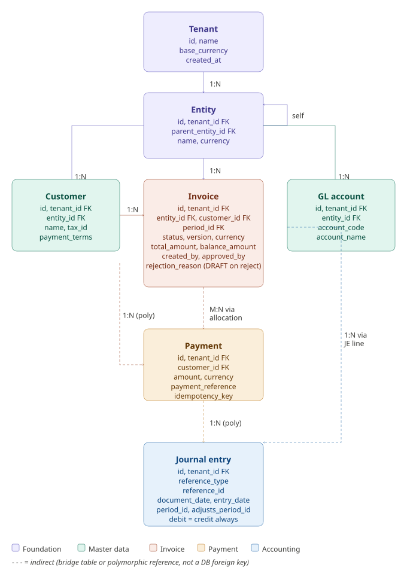
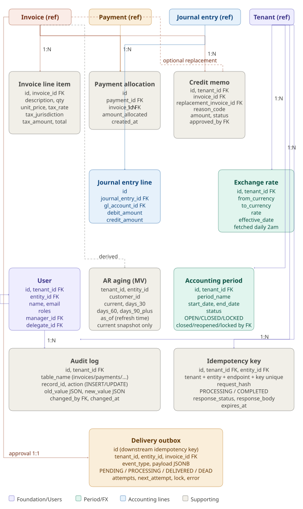

# Data Model — ERP AR Module

## Table of Contents
- [Entity List](#entity-list)
- [ER Diagram — Core Entities](#er-diagram--core-entities)
- [ER Diagram — Supporting Entities](#er-diagram--supporting-entities)
- [Table Schemas](#table-schemas)
- [Key Design Decisions](#key-design-decisions)

---

## Entity List

### Core Entities (system cannot function without these)

| Entity | Description |
|--------|-------------|
| Tenant | ERP customer — owns all data, one contract |
| Entity | Legal subsidiary within a tenant |
| Customer | External company being invoiced |
| Invoice | The bill sent to customer |
| Invoice Line Item | Individual line on an invoice |
| Payment | Money received from customer |
| Journal Entry | Accounting record of financial event |

### Supporting Entities

| Entity | Description |
|--------|-------------|
| GL Account | Chart of accounts for a tenant |
| Journal Entry Line | Individual debit/credit line in a journal entry |
| Payment Allocation | Links payment to one or more invoices |
| User | Person using the system (RBAC) |
| Audit Log | Immutable record of all changes (SOX) |
| Accounting Period | Month/year close tracking |
| Exchange Rate | Daily currency conversion rates |
| Credit Memo | Correction document against an invoice |
| AR Aging (materialized view) | Current derived snapshot by tenant, entity, and customer; refreshed every 5 minutes |
| Idempotency Key | Tenant- and endpoint-scoped write claim with request hash and cached response |
| Delivery Outbox | Durable invoice-delivery event committed atomically with approval and claimed by workers |
| FX Import Job | Durable pg_cron request claimed by the FX worker; retry and provenance boundary |

---

## ER Diagram — Core Entities

---

## ER Diagram — Supporting Entities

---

## Table Schemas

Full schema begins in [migrations/001_initial_schema.sql](../migrations/001_initial_schema.sql);
the delivery outbox is added by
[migrations/004_delivery_outbox.sql](../migrations/004_delivery_outbox.sql), and
the FX import/provenance foundation by
[migrations/006_fx_rate_ingestion.sql](../migrations/006_fx_rate_ingestion.sql),
base-currency aging by migration 007, and base-only realized-FX journal lines
by migration 008.

The completed V1 FX extension is specified in
[FX Rate Ingestion and Multi-Currency Design](fx-rate-design.md). Migration 006
implements `fx_import_job`, rate provenance/approval fields, immutable
supersession, and transaction-to-rate references. APIs snapshot transaction and
base values; payment allocations retain payment-rate value, AR carrying value
and the resulting realized gain/loss.

Key design decisions in the schema:
- UUID primary keys on all tables
- Row Level Security on every table (tenant isolation at DB level)
- Audit triggers fire automatically — cannot be bypassed by application code
- Journal entries are immutable — no UPDATE/DELETE ever
- SOX segregation enforced via CHECK constraint: invoice creator != approver
- Period close enforced via DB triggers — CLOSED requires an audited reopen;
  LOCKED is irreversible, and adjustments post to a current OPEN period while
  preserving the original document date
- Idempotency keys table prevents duplicate writes and safely replays completed
  responses; payment references provide a second database uniqueness guard
- Delivery outbox provides atomic approval/event persistence, multi-worker safe
  claims, retry state, and a stable downstream idempotency identifier
- AR Aging as a current-only materialized view — refreshed every 5 minutes;
  historical reporting requires event reconstruction or persisted snapshots
- Foreign-currency documents snapshot both the approved rate ID and numeric
  rate; approved rate corrections insert a superseding row rather than changing
  historical transactions
- Journal lines retain both document and base amounts. A realized-FX line may
  be base-only (zero on both document sides) but must have exactly one positive
  base debit/credit side; migration 008 enforces this shape

---

## Key Design Decisions
Coming soon
