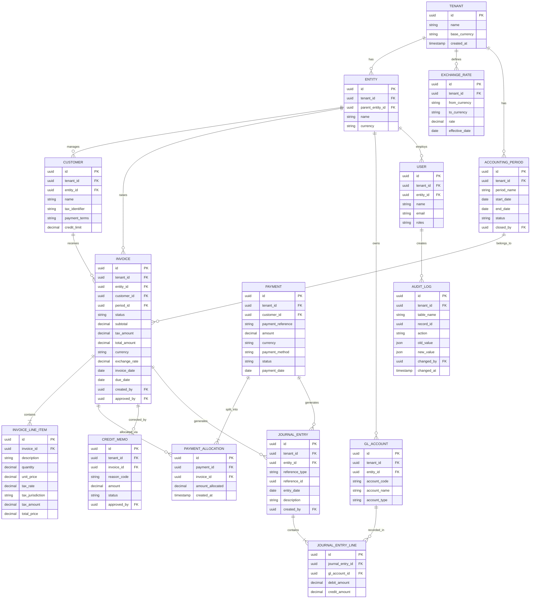

# ER Diagram — ERP AR Module

```mermaid
erDiagram
  TENANT ||--o{ ENTITY : has
  TENANT ||--o{ EXCHANGE_RATE : defines
  TENANT ||--o{ ACCOUNTING_PERIOD : has
  ENTITY ||--o{ CUSTOMER : manages
  ENTITY ||--o{ INVOICE : raises
  ENTITY ||--o{ GL_ACCOUNT : owns
  ENTITY ||--o{ USER : employs
  CUSTOMER ||--o{ INVOICE : receives
  INVOICE ||--|{ INVOICE_LINE_ITEM : contains
  INVOICE ||--o{ PAYMENT_ALLOCATION : allocated_via
  INVOICE ||--o{ CREDIT_MEMO : corrected_by
  INVOICE ||--o{ JOURNAL_ENTRY : generates
  PAYMENT ||--|{ PAYMENT_ALLOCATION : split_into
  PAYMENT ||--o{ JOURNAL_ENTRY : generates
  JOURNAL_ENTRY ||--|{ JOURNAL_ENTRY_LINE : contains
  GL_ACCOUNT ||--o{ JOURNAL_ENTRY_LINE : recorded_in
  ACCOUNTING_PERIOD ||--o{ INVOICE : belongs_to
  USER ||--o{ AUDIT_LOG : creates

  TENANT {
    uuid id PK
    string name
    string base_currency
    timestamp created_at
  }
  ENTITY {
    uuid id PK
    uuid tenant_id FK
    uuid parent_entity_id FK
    string name
    string currency
  }
  CUSTOMER {
    uuid id PK
    uuid tenant_id FK
    uuid entity_id FK
    string name
    string tax_identifier
    string payment_terms
    decimal credit_limit
  }
  INVOICE {
    uuid id PK
    uuid tenant_id FK
    uuid entity_id FK
    uuid customer_id FK
    uuid period_id FK
    string status
    decimal subtotal
    decimal tax_amount
    decimal total_amount
    string currency
    decimal exchange_rate
    date invoice_date
    date due_date
    uuid created_by FK
    uuid approved_by FK
  }
  INVOICE_LINE_ITEM {
    uuid id PK
    uuid invoice_id FK
    string description
    decimal quantity
    decimal unit_price
    decimal tax_rate
    string tax_jurisdiction
    decimal tax_amount
    decimal total_price
  }
  PAYMENT {
    uuid id PK
    uuid tenant_id FK
    uuid customer_id FK
    string payment_reference
    decimal amount
    string currency
    string payment_method
    string status
    date payment_date
  }
  PAYMENT_ALLOCATION {
    uuid id PK
    uuid payment_id FK
    uuid invoice_id FK
    decimal amount_allocated
    timestamp created_at
  }
  JOURNAL_ENTRY {
    uuid id PK
    uuid tenant_id FK
    uuid entity_id FK
    string reference_type
    uuid reference_id
    date entry_date
    string description
    uuid created_by FK
  }
  JOURNAL_ENTRY_LINE {
    uuid id PK
    uuid journal_entry_id FK
    uuid gl_account_id FK
    decimal debit_amount
    decimal credit_amount
  }
  GL_ACCOUNT {
    uuid id PK
    uuid tenant_id FK
    uuid entity_id FK
    string account_code
    string account_name
    string account_type
  }
  CREDIT_MEMO {
    uuid id PK
    uuid tenant_id FK
    uuid invoice_id FK
    string reason_code
    decimal amount
    string status
    uuid approved_by FK
  }
  EXCHANGE_RATE {
    uuid id PK
    uuid tenant_id FK
    string from_currency
    string to_currency
    decimal rate
    date effective_date
  }
  ACCOUNTING_PERIOD {
    uuid id PK
    uuid tenant_id FK
    string period_name
    date start_date
    date end_date
    string status
    uuid closed_by FK
  }
  USER {
    uuid id PK
    uuid tenant_id FK
    uuid entity_id FK
    string name
    string email
    string roles
  }
  AUDIT_LOG {
    uuid id PK
    uuid tenant_id FK
    string table_name
    uuid record_id
    string action
    json old_value
    json new_value
    uuid changed_by FK
    timestamp changed_at
  }
```
