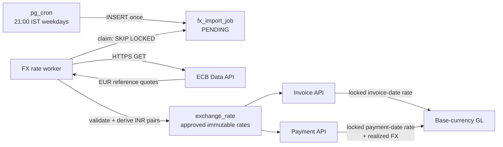

# FX Rate Ingestion and Multi-Currency Design

**Traceability:** DA3 / B1  
**Status:** `COMPLETE` for the approved V1 scope — ingestion, invoice-date and
payment-date rate locking, dual-currency journals, realized gain/loss, partial
payments and all fail-closed controls are implemented and tested

## Scope

The prototype will support invoices and payments in:

`INR, USD, EUR, CNY, GBP, JPY, CHF, CAD`

Reliance's entity base currency remains INR. Transaction documents retain their
original currency and amounts; all GL journal lines post in the entity's base
currency. V1 permits a payment only in the invoice's transaction currency.
Cross-currency settlement, such as paying a USD invoice with EUR, is V2.

## Component Flow



pg_cron only schedules a database insert. It does not make HTTP calls. The
worker owns network access, timeouts, retries and provider parsing. This keeps
external credentials and failures outside PostgreSQL while retaining a single
database-owned schedule across horizontally scaled application instances.

## Rate Source and Schedule

V1 uses the official [ECB Data API](https://data.ecb.europa.eu/help/api/data).
ECB publishes euro reference rates on working days at roughly 16:00 CET/CEST;
the import runs at 21:00 IST to allow a publication buffer. ECB explicitly
describes these as informational reference rates, so a production tenant must
adopt a Finance-approved accounting-rate policy/provider rather than assume the
ECB rate equals its executable bank rate.

The worker requests one provider batch containing INR, USD, CNY, GBP, JPY, CHF
and CAD quotes against EUR. EUR is implicitly 1. Every provider observation is
parsed with `Decimal`; binary floating point is prohibited.

ECB represents:

```text
1 EUR = X units of currency
```

For a foreign currency `F`, the worker derives the INR accounting rate as:

```text
F → INR = (INR per EUR) / (F per EUR)
EUR → INR = INR per EUR
INR → INR = 1 (derived internally; no provider row required)
```

## Persistence

### `fx_import_job`

Durable scheduled work with:

- provider and requested date;
- `PENDING`, `PROCESSING`, `COMPLETED`, `RETRY`, or `DEAD` status;
- attempt count, next attempt, last error and timestamps;
- unique provider/requested-date key so deploys and cron cannot duplicate work;
- raw response hash for provenance without treating the external response as
  the accounting source of truth.

Workers claim jobs with `FOR UPDATE SKIP LOCKED`. Retries use bounded
exponential backoff; exhausted jobs become visible as `DEAD`.

### `exchange_rate`

Migration 006 extends existing rate storage with:

- `rate_type` (`DAILY_REFERENCE` in V1);
- provider/effective date and fetch timestamp;
- raw EUR quote plus derived-rate indicator;
- raw response hash/import-job reference;
- `PENDING`, `APPROVED`, `REJECTED`, or `SUPERSEDED` status;
- manual-override flag, approval actor/time and optional superseded-rate link.

Approved rates are immutable. A correction inserts a superseding record; it
never updates the rate used by an existing transaction. Only one approved rate
may exist for a tenant, currency pair, effective date and rate type.

The same provider batch is copied into each tenant's approved-rate namespace.
This duplicates small reference data but allows different tenants to choose a
provider, rate type or emergency override without changing another tenant's
books.

### Transaction snapshots

Invoice and Payment will store both the rate record ID and numeric rate. The ID
provides provenance; the numeric snapshot makes the financial document
self-contained and prevents later policy changes from changing historical
amounts. Payment allocations will retain transaction and base amounts needed
to explain partial AR release.

## Lookup and Failure Rules

1. Same-currency conversion uses rate 1 without an external lookup.
2. Otherwise select the latest `APPROVED` rate with
   `effective_date <= transaction_date`.
3. The selected rate may be at most three calendar days old, allowing normal
   weekends.
4. An older/missing rate rejects the financial write with
   `503 FX_RATE_UNAVAILABLE`; the system never silently substitutes 1.0.
5. The response discloses the rate ID, numeric rate, provider effective date
   and whether a prior-business-day rate was used.
6. A long market holiday or provider outage requires a Finance-entered rate.
   The manual-entry and CFO-approval API is V2, but its immutable approval model
   is part of this design.

This is a deliberate consistency-over-availability decision: delaying a
posting is preferable to corrupting the books with an invented rate.

## Financial Posting

### Invoice approval

For a USD 1,000 invoice at an invoice-date rate of INR 83/USD:

```text
Transaction receivable: USD 1,000
Base receivable:        INR 83,000

Dr Accounts Receivable  INR 83,000
Cr Revenue/Tax           INR 83,000 combined
```

Revenue and tax lines use the locked invoice rate. AR is the balancing line.
Calculations use `Decimal`; journal amounts use entity-currency precision.

### Payment and realized FX

If the USD 1,000 is paid when the rate is INR 84/USD:

```text
Dr Cash                  INR 84,000
Cr Accounts Receivable   INR 83,000
Cr Realized FX Gain       INR 1,000
```

If the payment-date base amount is lower, the difference is a debit to FX
Gain/Loss. For partial payment, AR is released using the invoice's locked rate;
the final allocation releases the exact remaining base AR to avoid accumulated
rounding drift. Unallocated overpayment credits Customer Credit at the payment
rate, not AR.

AUTO allocation considers only open invoices belonging to the same customer,
entity and transaction currency as the payment. MANUAL allocation rejects any
mixed-currency invoice. A single payment may cover several same-currency
invoices with different invoice-date rates; realized FX is summed from the
individual allocations.

## Validation and Observability

- Currency codes are allow-listed and normalized to uppercase.
- Provider payload must contain every configured currency, positive finite
  rates, one coherent provider date and no duplicate codes.
- Provider URL is configuration, not request input; the worker cannot be used
  as a general HTTP proxy.
- Import metrics include last successful provider date, job lag, retry/DEAD
  count and rate freshness.
- Health warns when rates are stale but does not mark INR-only operations
  unhealthy; a foreign-currency write still fails closed when its rate is stale.
- Logs record job/rate IDs and trace context without logging provider payloads
  or financial request bodies unnecessarily.

## Test Strategy

Integration tests use a checked-in deterministic ECB-shaped fixture, not the
live internet:

1. idempotent job creation/import and supported-pair derivation;
2. weekend lookup uses the preceding Friday within the three-day limit;
3. missing/stale rate is rejected and creates no invoice/payment/journal;
4. USD invoice stores transaction/base amounts and the exact rate snapshot;
5. approval posts a balanced INR journal;
6. later USD payment posts balanced Cash/AR/realized-FX lines;
7. FX loss and partial-payment cases;
8. mixed-currency allocation rejection;
9. existing INR walkthrough remains unchanged;
10. optional live provider contract smoke test, excluded from the deterministic
    default suite.

## Explicit V2 Scope

- paying an invoice with a different transaction currency;
- tenant-configurable provider and rate-type UI;
- manual rate entry/approval API;
- period-end unrealized FX revaluation and reversal;
- hedging, forward/average rates and bank-settlement reconciliation;
- licensed production market-data provider and provider failover.
