# High-Level Design — ERP AR Module

## Table of Contents
- [Overview](#overview)
- [HLD Diagram](#hld-diagram)
- [API Flow Details](#api-flow-details)
- [NFR Layer](#nfr-layer)

---

## Overview

Modular monolith architecture for prototype. All components run in Docker on a single host. PostgreSQL is the single source of truth — no Redis, no external cache. Zero Trust security — JWT validated at both gateway and application layer.

Core request flow:
Client → L7 API Gateway → AR Application (FastAPI) → PostgreSQL

Asynchronous delivery flow:
AR approval transaction → PostgreSQL delivery_outbox → Outbox Worker → Delivery Stub

Key decisions:
- L7 Gateway: JWT signature check only — stateless, no header extraction
- AR Application: re-validates JWT independently (Zero Trust)
- No Redis: PostgreSQL enforces all consistency guarantees
- ACID transactions: all financial operations atomic
- Optimistic locking: version column prevents ABA problem
- Audit triggers: DB-level, cannot be bypassed by application code
- Period close: enforced at both app and DB trigger level
- pg_cron: runs once inside PostgreSQL and refreshes the aging MV concurrently
  every 5 minutes; readers retain the previous complete snapshot during refresh

---

## HLD Diagram

API flows shown in diagram:
- ① POST /invoices — invoice creation (FR1)
- ② GET /invoices/{id} — invoice retrieval (FR1)
- ③ POST /invoices/{id}/approve — invoice approval + GL entries (FR2)
- ④ POST /payments — payment recording + allocation (FR4)
- ⑤ GET /customers/{id}/aging — AR aging report (FR8)
- ⑥ GET /journal-entries — GL journal entries (FR9)
- ⑦ GET /health — operational health check (NFR5)

① ② ③ ④ ⑤ ⑥ = business APIs (FRs)
⑦ = operational API (NFR5)

---

## API Flow Details

### ① POST /invoices (FR1)
- Required role: invoice_creator
- X-Idempotency-Key required
- Server calculates: subtotal, tax, total, due_date (never trust client)
- Credit limit check before creation
- ACID transaction: invoice + line_items saved atomically
- Audit trigger fires automatically (DB level)
- Result: 201 Created, status=DRAFT, version=1

### ② GET /invoices/{id} (FR1)
- Required role: any authenticated user of same entity
- No idempotency key (read only)
- Live JOIN across: invoice, line_item, payment, payment_allocation, credit_memo, audit_log
- Always fresh — staleness not acceptable for invoice detail
- ETag header = version number (used as If-Match on subsequent writes)
- No audit log written (reads not audited)
- Result: 200 + payment history + credit memo history + status history

### ③ POST /invoices/{id}/approve (FR2, FR9, FR12, FR13)
- Required role: invoice_approver or cfo
- X-Idempotency-Key required
- If-Match: version required (ABA prevention via optimistic locking)
- SOX check: approver_id must differ from created_by (enforced in code + DB constraint)
- Period close check: invoice_date period must be OPEN (enforced at app + DB trigger)
- GL entries generated atomically in same ACID transaction:
  - Debit  Accounts Receivable  total_amount
  - Credit Sales Revenue        subtotal_amount
  - Credit Tax Payable          tax_amount
- PENDING delivery_outbox event saved in that same transaction
- Separate worker claims events with FOR UPDATE SKIP LOCKED, calls the delivery
  stub after commit, retries failures, and records sent_at after success
- Audit trigger fires automatically
- Result: 200, status=APPROVED, version+1, journal_entry_id, delivery_status=QUEUED

### ④ POST /payments (FR4, FR11)
- Required role: payment_recorder
- X-Idempotency-Key required
- Serializable isolation level (strictest) — prevents double allocation
- Allocation modes: AUTO (FIFO oldest first) or MANUAL (client specifies)
- One GL entry for entire payment (not per invoice):
  - Debit  Cash  total_payment_amount
  - Credit AR    total_payment_amount
  - + FX Gain/Loss line if multi-currency
- Payment allocation detail stored in payment_allocation table
- Defence in depth: idempotency key + UNIQUE(tenant_id, customer_id, payment_reference)
- Result: 201 + allocations + journal_entry_id

### ⑤ GET /customers/{id}/aging (FR8)
- Required role: any authenticated user
- Reads from ar_aging materialized view (pre-computed)
- 5 minute staleness acceptable — collections team reviews once daily
- as_of timestamp shown in response (explicit staleness)
- Deployment target: MV refreshed by pg_cron every 5 minutes inside PostgreSQL
- Integration test also refreshes explicitly for deterministic assertions; live fallback handles a missing MV row
- No Redis, no external cache — consistent with no-Redis decision
- Result: 200 + aging buckets + as_of timestamp

### ⑥ GET /journal-entries (FR9)
- Required role: any authenticated user + auditor role sees all entities
- invoice_id required filter (SOX — must be traceable to source document)
- Live query — journal entries immutable but must never appear missing (SOX!)
- Page-based pagination (max 20 rows per invoice — cursor not needed)
- Indexed on: tenant_id, reference_type + reference_id, entry_date
- Result: 200 + journal entries + lines + pagination

### ⑦ GET /health (NFR5)
- No auth required — used by Docker, load balancer, DataDog
- Shows: DB status, MV age, last reconciliation status
- Result: 200 healthy or 503 unhealthy

---

## NFR Layer

### Consistency (NFR1)
- System is CP (Consistency + Partition Tolerance)
- Returns 503 rather than serve wrong financial data
- Exception: AR aging (5 min staleness acceptable)

### Security (NFR4)
- L7 Gateway: JWT signature check (early rejection)
- AR Application: re-validates JWT independently (Zero Trust)
- Both fetch public keys from Auth Server JWKS endpoint
- kid header in JWT → lookup correct public key → verify signature

### Observability (NFR5)
- Gateway injects X-Trace-ID on every request
- Flows through AR App → PostgreSQL → audit_log
- DataDog APM traces full request lifecycle
- PagerDuty alerts on: AR/GL mismatch, payment failure > 1%, DB down

### Scalability (NFR6)
- AR Application is stateless → horizontal scaling via load balancer
- No stickiness needed — JWT carries all context
- PostgreSQL: primary for writes, read replica for reporting (Phase 2)

---
